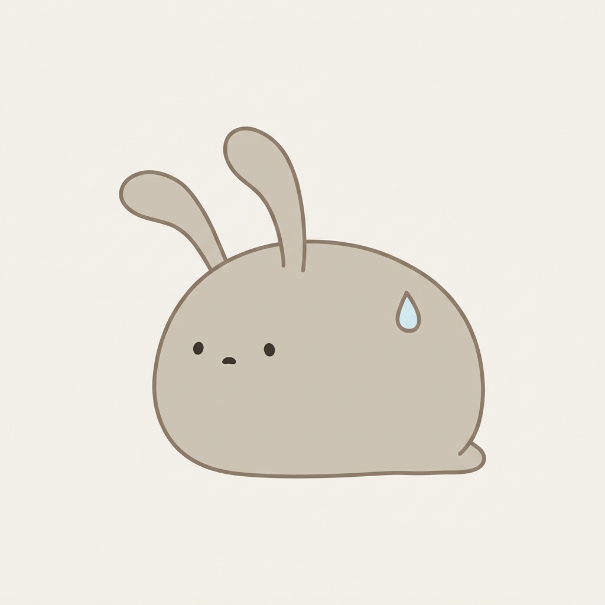
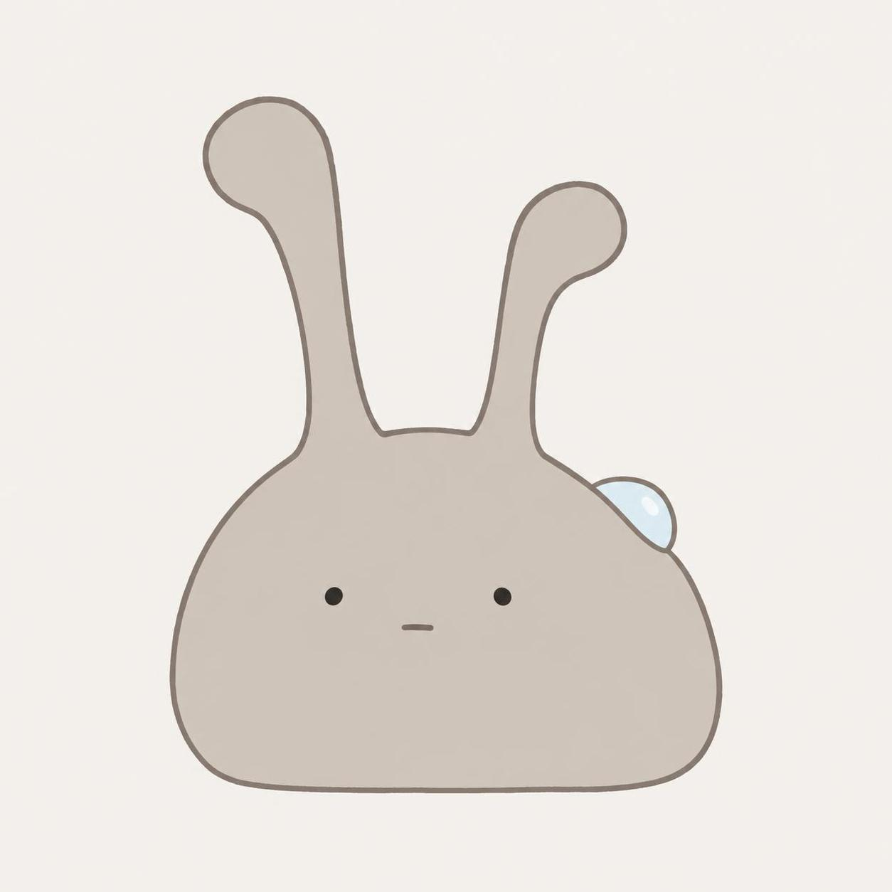
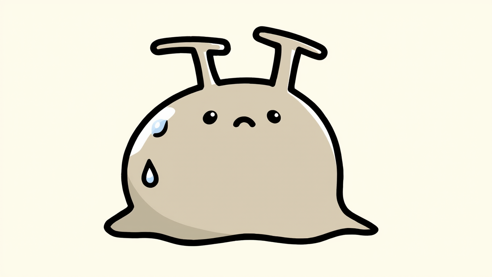
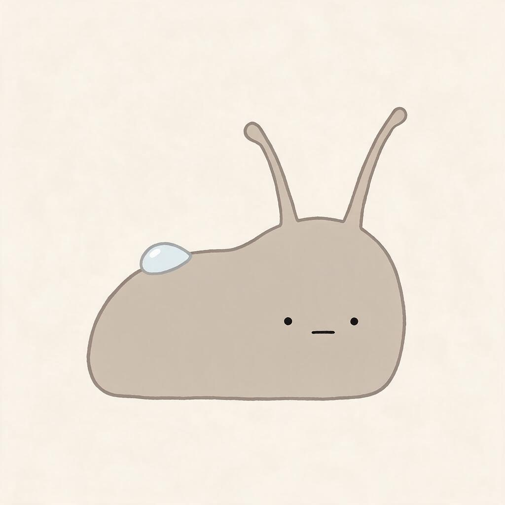

# 言葉だけで4つのAIに同じナメクジを頼んだら、触角が4通り出てきた

## 前回のつづき

やってみ太郎です。へんてこ商事という会社で、中小企業のお客様向けにDX(業務をデジタルで変えること)やAI導入のお手伝いをしています。
AIで何かを「やってみた」記録を、1日1件ずつ残しています。

前回は、画像を1枚も作らずに、キャラクターの核を言葉だけで決めました。
主人公はナメクジの「ぬめ」。朝の短い時間だけ、乾きかけた苔に露を運ぶ子です。
最後にこう書きました。言葉で決めた核が、絵にしたときにちゃんと残るのか。今日はそれを確かめる日です。

正直に言うと、簡単だと思っていました。
設定書はもうあるんです。それを指示文(プロンプト)に書き直して、画像生成AIに渡せばいい。
あとはAIごとの「かわいさ」の違いを眺めて、好きなのを選ぶだけ。そう思っていました。

## 描く前に、調べることにした

いきなり描かせる前に、Claudeに頼んで、いまAIにゆるキャラを描かせるときのコツを調べてもらいました。
これが最初の「あれ」でした。

「ゆるキャラ」という言葉を、指示文に書かない方がいいらしいんです。
日本語の記事で定番になっている指示文は、着ぐるみの写真を作る型でした。生地の質感、縫い目、中に人がいる気配。
英語で「kawaii mascot」と頼むと、今度は大きなキラキラした目と、頬の赤みが既定で付いてきます。
私の設定書は「目は小さい点」「パペット風にしない」です。どっちの既定とも正反対でした。

もうひとつ、少し安心したこともあります。
かわいいナメクジの描き方には定石があって、体は豆の形、粘液とツヤは描かない、色は単色、とのこと。
設定書に書いた「丸く短い体」「彩度を抑えた一色」は、知らずにその線に乗っていました。

## 指示文を1本、物差しを1枚

指示文は1本だけ書いて、全部のAIに同じものを渡すことにしました。
同じ言葉に対して、AIごとに何を勝手に足すのかが見たかったからです。

書いていて決めなければいけないことが、いくつも出てきました。
「薄い灰色」では幅が広すぎるので、色は16進数のカラーコード(#CFC8BEのような、色を数値で表す書き方)で指定する。
露は背中に1粒だけ。基本の表情は、少し心配そう。
触角は左右で長さを少し変えて、整いすぎないようにする。
全部、前回の設定書には無かった判断です。言葉を絵にする手前で、まだこんなに決めることが残っていたんですね。

もうひとつ、評価表を作りました。
体が豆型か。目が小さな点か。粘液やツヤがないか。着ぐるみに見えないか。殻が付いてカタツムリになっていないか。
8項目の○×で見る物差しです。「かわいい」の判断がその場の気分で揺れるのを防ぐためでした。

比べる相手は、当初はMidjourneyとStable Diffusionを含めた4つの予定でした。
でも実際に手元で回せたのは、Nano Banana Pro、GPT Image 2.5、Kling 3.0、Seedream 5.0 Proの4つ。
予定は初日から変わりました。

## 4枚が返ってきた

正面と書いたので、正面が出てくるに違いない。そう思って待ちました。

Nano Banana Proの絵は、横を向いていました。
色も平塗りも指示どおりで、一番忠実です。ただ、2本の触角がウサギの耳に見える。
そして背中の露が、涙の形になって顔の横に付いていました。漫画でいう冷や汗の記号です。

GPT Image 2.5は、唯一ちゃんと正面を向いていました。
触角が太くて大きくて、先が丸い。点の目と、短い線の口。一番「触角で気持ちを語れそう」な顔でした。
その代わり、心配そうには見えません。無表情です。あと、画面いっぱいに大きい。

Kling 3.0は、禁止したものを一番たくさん描いてくれました。
太い黒の輪郭線、目の中の白い光、泣き顔、体のツヤ、汗が2粒。
ステッカーみたいなかわいさで、これはこれで好きな人は多そうです。でも設定書の子ではない。

Seedream 5.0 Proは、一番ナメクジに見えました。
横向きで、豆というより食パンの形。触角は細い糸のようで、現実のナメクジに近い。
背景にうっすら紙の質感が足されていました。頼んでいないのに。

## 触角のことを、何も書いていなかった

4枚を並べて、まず触角を見ました。
ウサギの耳、先が丸い太い棒、T字、細い糸。4つとも違います。

指示文を読み返しました。触角については「体に対して大きい」「左右で長さが違う」としか書いていません。
太さも、先の形も、どこから生えるかも、書いていなかった。
このキャラは「触角の向きで気持ちを表す」子です。つまり触角が顔なんです。
一番大事な部位の形を、一番書いていなかった。設定書に「大きい」とあったので、それで決まった気になっていました。

冷や汗にも理由がありました。
指示文には「少し心配そうに」と「背中に露を1粒」が隣り合って書いてあります。
心配、しずく。AIの中でこの2つが合体して、漫画の冷や汗という既製品の記号になった。
2つのAIが同じことをしたので、偶然ではなさそうです。

一方で、守られたものもあります。
色です。16進数で書いた体の色と背景の色は、4つとも再現されました。
言葉で書いたものは揺れて、数値で書いたものは揺れない。当たり前かもしれませんが、4枚並べると説得力がありました。

## 1枚を選べなかった

評価表で○を数えると、Nano Banana、GPT Image、Seedreamの3枚が8項目すべて○。Klingは4つでした。
物差しは足切りには役に立ちました。でも、満点の3枚から1枚を選べません。

結局、選んだのは物差しではなく好みでした。
体はKlingのものがいい。地面にべたっと広がった、柔らかい塊の形。
顔はGPT Imageのものがいい。点の目と、太くて先の丸い触角。
評価表で一番点が低かった絵の「体」を選んでいるのが、自分でもおかしかったです。
禁止を破った絵の中に、言葉にしていなかった好みが混ざっていました。

というわけで、1枚は決まりませんでした。
代わりに、「この絵の体と、この絵の顔」を次に合成する方向が決まりました。

## 今日の学び

- 「ゆるキャラ」と書くと、AIは着ぐるみか大きなキラキラ目を持ってくる。言葉ではなく中身(丸い、点目、平塗り)を書く。
- 一番大事な部位ほど、書き忘れる。触角が顔のキャラなのに、触角の形を書いていなかった。
- 隣り合う2つの指示は、既製品の記号に合体する。「心配」と「しずく」が冷や汗になった。
- 色は数値で書けば守られる。揺れてほしくないものは、言葉から数値に変える。
- 物差しは足切りに効く。でも最後に選ぶのは好みで、その好みは禁止を破った絵の中にあった。

指示文の全文、評価表、調べたことのメモは、リポジトリに置いてあります。
https://github.com/h-takeshita-henteco-shoji-com/tried/tree/main/2026/10-03-かわいいキャラのショート動画をAIで作る-02-キャラ画像を生成AIで固める/assets

## 次にやること

次は、KlingとGPT Imageの2枚を参照画像(お手本として一緒に渡す画像)にして、「体はこっち、顔はこっち」とAIに頼んでみます。
言葉だけで4通りに割れた触角が、お手本を添えると揃うのか。
それから、表情を顔ではなく触角の向きだけで出す、という設定書の方針が本当に絵で成り立つのか。
前回「言葉で決めた核が絵に残るか」と書きましたが、半分は残り、半分はまだ分かりません。残り半分は、お手本を渡してからです。
