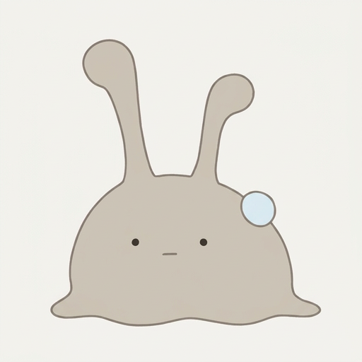
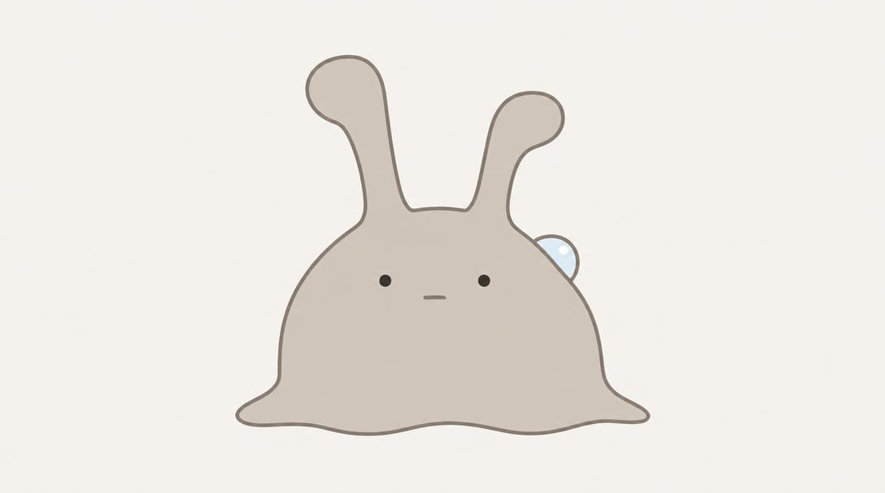
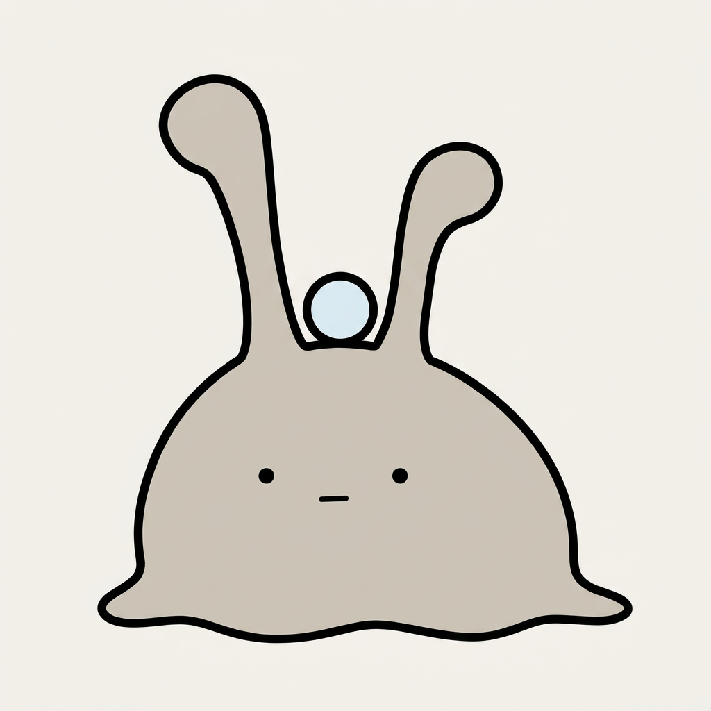
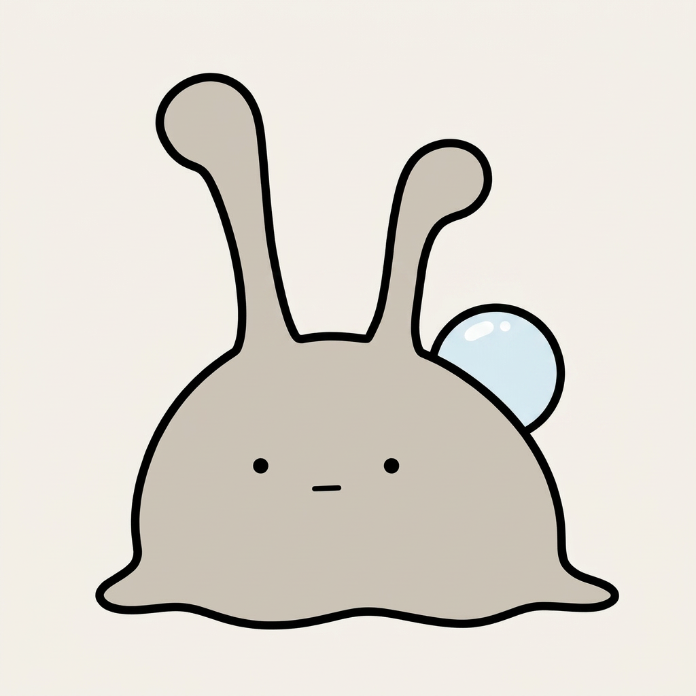
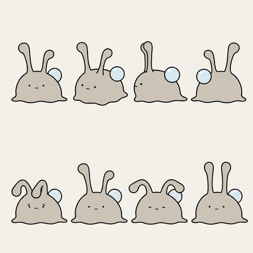

# お手本を1枚添えたら、2つのAIが同じナメクジを描いた。でも露は頭に載った

## 前回のつづき

やってみ太郎です。へんてこ商事という会社で、中小企業のお客様向けにDX(業務をデジタルで変えること)やAI導入のお手伝いをしています。
AIで何かを「やってみた」記録を、1日1件ずつ残しています。

前回は、言葉だけの指示文で4つのAIにナメクジの「ぬめ」を描かせました。
返ってきた触角は、ウサギの耳、先の丸い太い棒、T字、細い糸。4枚とも違いました。
1枚には決められず、「体はKlingのこの絵、顔はGPT Imageのこの絵」と、2枚の良いところを採る方向だけ決めて終わりました。

今日はその2枚を、参照画像(お手本として一緒に渡す画像)としてAIに添えます。
言葉で4通りに割れたものが、お手本を添えれば揃うのか。それが今日の問いです。
時間は1時間と決めました。先に言っておくと、守れませんでした。

## 2枚が、ほぼ同じだった

指示文は前回の終わりに用意してありました。
「1枚目からは体の形だけを採る。太い黒線も、ツヤも、泣き顔も、汗も採らない。2枚目からは顔と触角を採る」。
これを2枚の画像と一緒に、Nano Banana 2.0 ProとGPT Image 2.5に渡しました。

揃うかどうか、半々だと思っていました。前回の4枚のばらつきを見ているので。

返ってきた2枚を並べて、少し拍子抜けしました。
ほぼ同じ姿なんです。ドーム型で裾が波打つ体。点の目と短い線の口。太くて先が丸い触角。左右で長さが違うところまで。

前回、触角の形を言葉で書いていなかったことを反省して、今回は太さも先の形も書きました。
でも、効いたのは言葉ではなくお手本の方だと思います。
GPT Imageの触角をそのまま持ってきた絵が、2つのAIから返ってきたので。

違いは小さいものでした。
GPT Imageは正方形と書いたのに横長にしてきた。Nano Bananaは露が体の右上に乗っていて、少し冷や汗の位置に近い。
どちらを選んでも困らない。前回あれだけ割れたのが嘘のようでした。

## 禁止したはずの線が、欲しくなった

決定稿はNano Bananaの方にしようと思いながら2枚を眺めていて、別のことが気になりだしました。
輪郭です。

指示文には、Klingの太い黒線は採らない、と書いてあります。
前回の評価表で、Klingは禁止事項を一番たくさん破った絵でした。
それなのに体の形はKlingから採った。その続きで言うと、あの太い黒線も、やっぱり欲しかったんです。

前回「禁止を破った絵の中に、言葉にしていなかった好みが混ざっていた」と書きました。
今日はそれがもう一つ見つかった、ということになります。
細い灰色の線で描かれた2枚は、きれいだけれど少し頼りない。輪郭を太い黒にしたい。
設定書にも指示文にも無かった判断を、ここで足しました。

直しは、同じチャットの続きで頼むつもりでした。
ところがGeminiの画面で、続きが送れない。原因はよく分かりません。
仕方なく新しいチャットを開き、1回目の結果を1枚添えて、「この絵と同じデザインのまま、輪郭だけ太い黒線にして」と頼みました。
ついでに露も、「背中の上、2本の触角の間の中央」に動かしてもらうことにしました。

輪郭は、狙いどおりでした。均一な太い黒線。目と口はそのまま。
そして露は、頭の上に載っていました。
触角の間に、玉を1つ、ちょこんと。

## 正面から見たナメクジに、背中はない

おかしいのはAIではなく、私の指示でした。
「背中の上、触角の間の中央」。正面から見た絵で、この言葉が指す場所はどこか。
背中は体の後ろ側にあって、正面からは見えません。見えない場所を指定されたAIは、言葉が指す唯一の見える場所、つまり体の上の縁に露を置いた。
触角の間の中央、という指定は、そのとおりに守られています。

露は「背中に1粒」と設定書に書いた日から、ずっと背中にあるつもりでした。
でも正面の絵にしたとき、背中はどこにも描かれない。
前回の冷や汗もそうでしたが、露はどうもこのキャラの中で一番、言葉と絵がずれる部品のようです。

ここでGeminiのクレジットが尽きました。
時間は30分を過ぎたあたり。残りをGPT Imageで続ける案を用意してもらいながら、少し迷って、課金しました。
1時間と決めたのに、お金で時間を買っている。この判断が正しかったのかは、まだ分かりません。

直しの指示文は、見える範囲で書き直しました。
「体の輪郭の右上の縁の後ろから、露の上半分だけがのぞく。下半分は体に隠れる」。
背中という言葉は使っていません。正面から見えるものだけを書きました。

通りました。露は体の縁の向こうからのぞいていて、背中にあると読めます。
白い光が1つ入って、ちゃんと水滴に見える。
これを決定稿にしました。露は少し大きい気もしますが、今日はここまでにします。

## 8匹とも同じ子だった。ただし眉が生えた

決定稿を参照に、三面図と表情のシートを頼みました。
上の段に正面、斜め、横、後ろ。下の段に表情を4つ。
表情は顔を変えず、触角の向きだけで出す。「心配は前に倒す、満足は立てて開く、疲れは横に垂らす、驚きはまっすぐ立てる」。
設定書の「触角が顔」という方針を、絵で試す場面です。

8匹とも、同じ子に見えました。
体、触角、露。横を向いても後ろを向いても、崩れていない。
前回の私なら、これだけで喜んでいたと思います。

触角の向きも、4つとも指示どおりでした。
ただ、下の段の「心配」と「疲れ」の枠をよく見ると、顔に眉が描かれています。
「目と口は4つとも変えない」と書いたのに、です。

指示文を読み返して、気づきました。
「触角だけで出す」と書いたすぐ隣に、「心配」「疲れ」という気持ちの言葉を書いている。
AIにとって、心配という言葉は顔に出すもので、その既定の方が「顔は変えない」より強かった。
前回「心配」と「しずく」が冷や汗に合体したのと、同じ形の出来事です。気持ちの言葉は、顔に出たがる。

もう一つ、画像が小さく出ました。決定稿の半分の大きさで、1枠がとても小さい。
後で動画や学習の参照に使うには、1枠ずつ作り直す必要がありそうです。
時計を見ると、80分が過ぎていました。シートの直しは次回に回します。

## 今日の学び

- お手本を1枚添えると、2つのAIが同じ姿を返した。前回の4通りの触角は、言葉の曖昧さが原因だった。見た目を揃えたいなら、言葉を詰めるよりお手本を1枚作る方が早い。
- 正面の絵に、背中はない。「背中の上」と書いた露は頭に載った。見えない場所は、「縁の後ろから上半分だけ見える」のように、見えるものだけで書き直す。
- 「触角だけで出す」と書いても、「心配」と書いた枠には眉が生えた。気持ちの言葉そのものが、顔に出る引き金になる。次は向きだけを書く。
- 直しは新しいチャットでも引き継げる。直前の結果を1枚添えて、変えない点を先に並べ、変える点を1つに絞る。
- 禁止した絵の中の好みが、今日も1つ見つかった。太い黒線。設定書は、絵を見るたびに書き足されていく。

指示文の全文と、今日生成した画像は、リポジトリに置いてあります。
https://github.com/h-takeshita-henteco-shoji-com/tried/tree/main/2026/10-05-かわいいキャラのショート動画をAIで作る-03-参照画像で決定稿と三面図を作る/assets

## 次にやること

三面図と表情のシートを、1枠ずつ大きく作り直します。
表情の枠には「心配」のような気持ちの言葉を書かず、「触角を前に倒す」とだけ書いてみる。眉が生えないかどうか。
それと、1時間と決めてクレジット切れで課金した今日の判断を、もう一度考えたいと思っています。
次にクレジットが尽きたとき、別のAIに切り替えるのか、その日は終わりにするのか。先に決めておかないと、また80分になりそうです。
