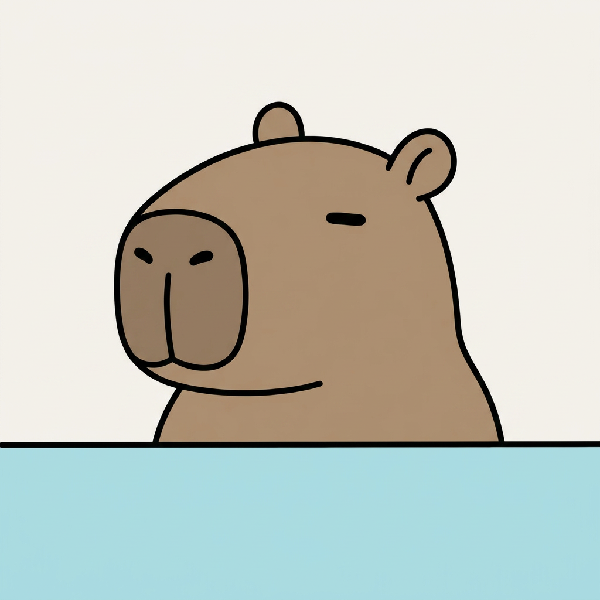
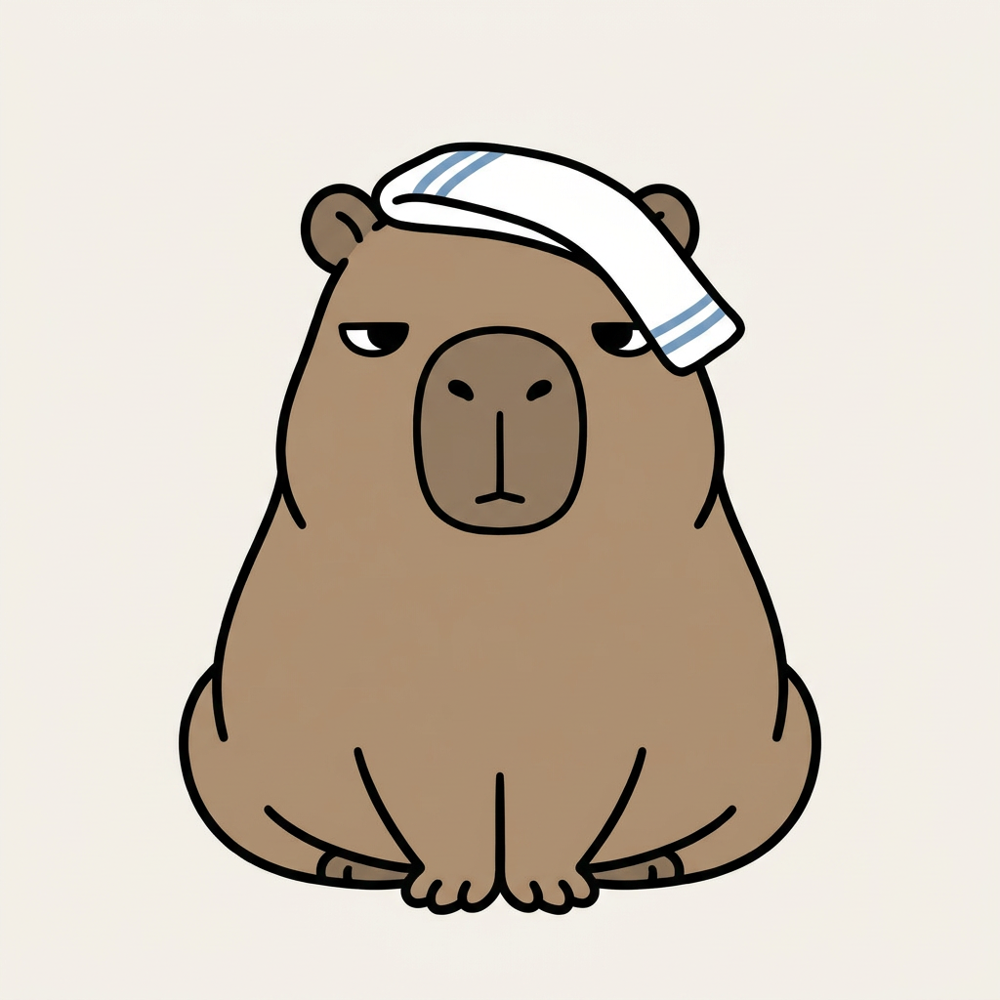
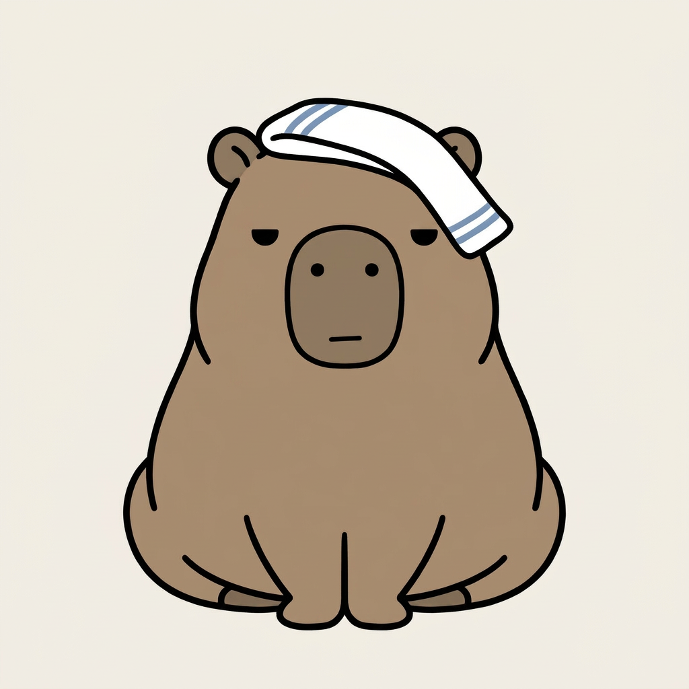
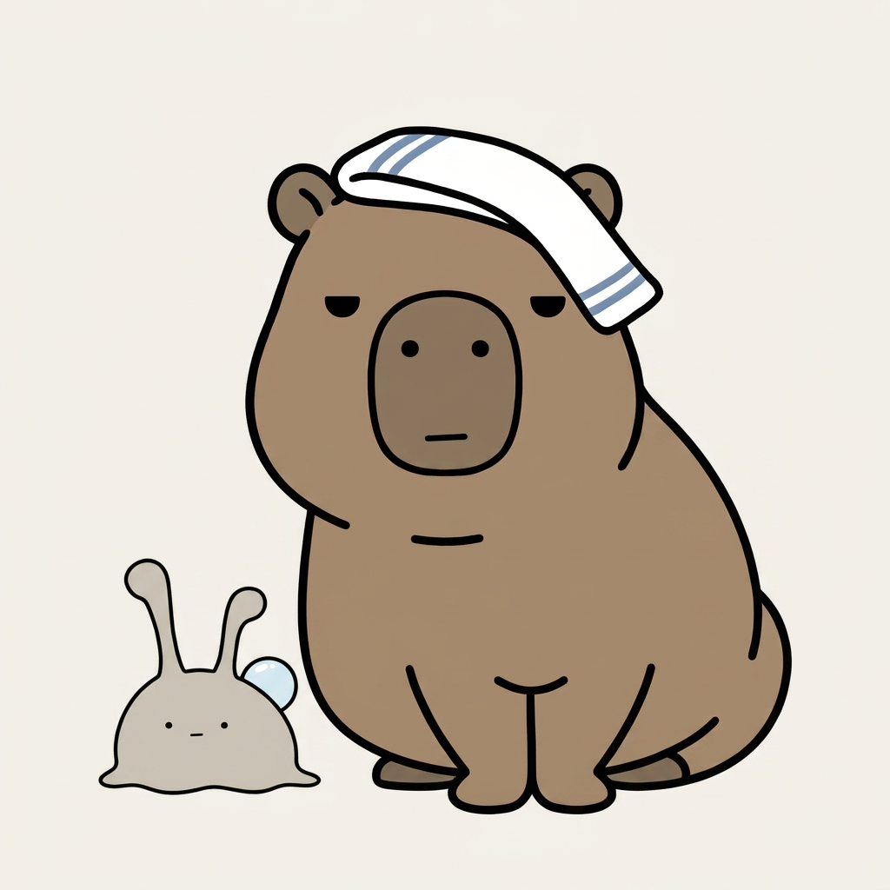
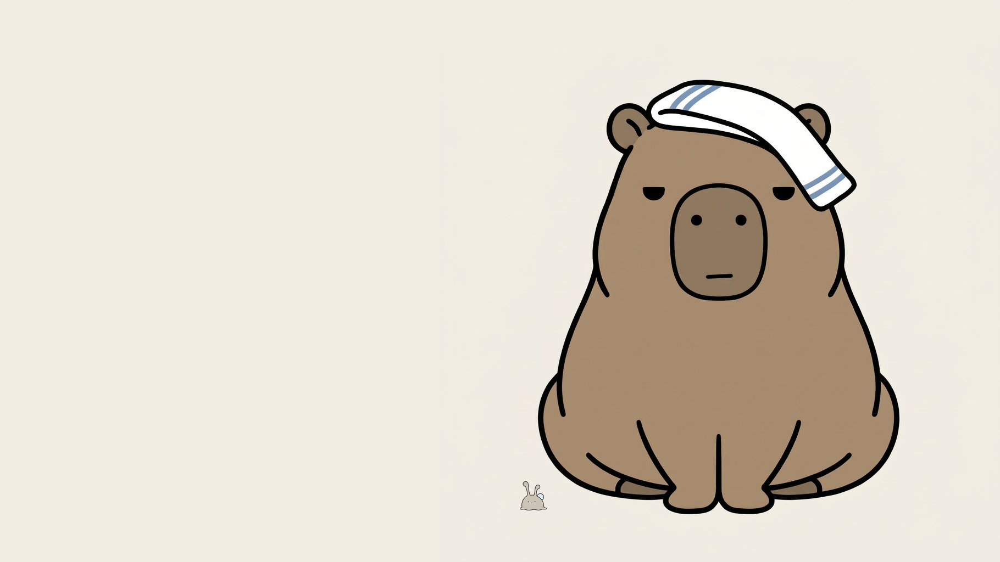
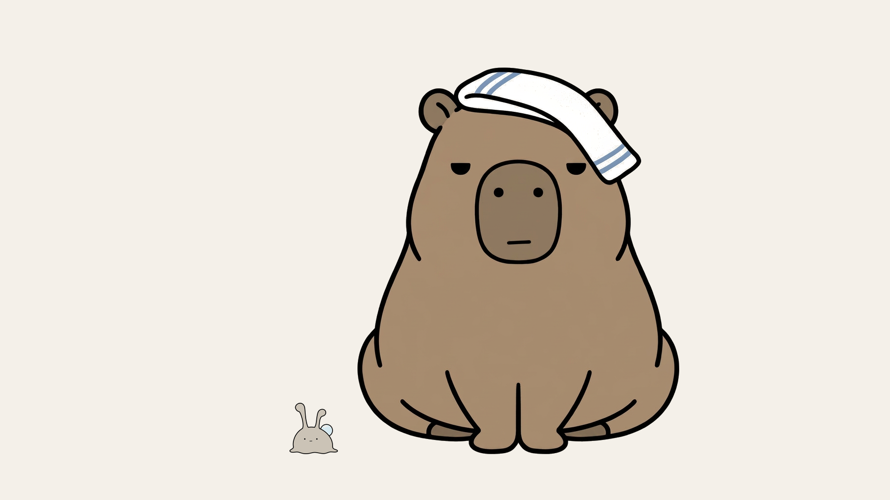
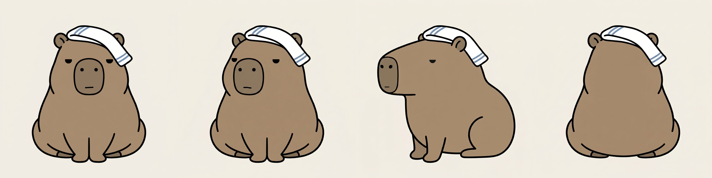

# カピバラの「どん」を描いてもらった。画風はお手本1枚で移った。性格は、移らなかった

## 前回のつづき

やってみ太郎です。へんてこ商事という会社で、中小企業のお客様向けにDX(業務をデジタルで変えること)やAI導入のお手伝いをしています。
AIで何かを「やってみた」記録を、1日1件ずつ残しています。

毎朝、乾きかけた苔に露を1粒運ぶナメクジの「ぬめ」。
それを温泉の湯だまりから見ているカピバラの「どん」。
ぬめの絵は、もう決まっています。どんには、まだ絵がありません。
3日前に「どんは画風が決まってから」と後回しにして、そのままでした。

今日は、ぬめの決定稿(これを正解とする1枚)をお手本にして、どんを描いてもらいます。
ナメクジで決めた画風を、カピバラという別の動物に移せるのか。
お手本1枚でそれができるなら、この先、仲間が増えても怖くない。

時間は1時間と決めました。
前回も同じことを書いて、80分かかっています。今日はもっとかかりました。

## 1枚目は、描かれる前に止められた

指示文はClaudeに書いてもらいました。
「添付の絵は画風のお手本。このキャラは描かず、同じ画風で新しいカピバラを描く。湯に浸かり、首から下は水の下に隠れている。目は半分閉じている」。
これをぬめの決定稿と一緒に、画像生成サービスのNano Banana Proへ送りました。

返ってきたのは絵ではなく、「Moderated」という表示でした。
モデレーション、つまり不適切な画像を出さないための仕組みに止められた、という意味です。

理由は書かれていません。
Claudeの推測は3つでした。「水の下に隠れる」が、溺れている動物に読めたのかもしれない。「このキャラは描くな、画風だけ写せ」が、他人の画風を写す依頼に見えたのかもしれない。半分閉じた目と首の組み合わせが、ぐったりして見えたのかもしれない。

言い換えたのは、場面の説明だけです。
「温泉でくつろぐカピバラ。日本の温泉に浸かるカピバラのように」。
絵の中身は、ほぼ同じのまま。今度は通りました。

均一な太い黒線。影のない平塗り。無地の背景。
ナメクジのお手本1枚で、カピバラにちゃんと同じ画風が移っていました。
今日の問いには、この1枚でもう答えが出た、と思いました。

## 「普通っぽい」の先にあったもの

眺めているうちに、物足りなくなってきました。
かわいい。でも、どこかで見たことのあるカピバラなんです。
口にできたのは「少し普通っぽい」という一言だけでした。

まず、手ぬぐいを頭に乗せたい、と頼みました。
温泉のカピバラなら、それだけで目印になる気がしたからです。

それでも、何かが違う。
今度はClaudeに聞いてみました。「どんは、どんな性格でしたっけ。性格が絵に出ていない気がします」。

どんの性格は、前回、何時間もかけて決めてあります。
動じない。察するが、言わない。冬を何回も見た年長者。急ぐことと、湯から出ることが苦手。
Claudeは絵とこの設定を照らし合わせて、ずれを3つ挙げました。

- 口が、頬まで伸びて笑っている。笑顔は「人なつこい」に読める。どんは「言わない」側のはずです。
- 目が線1本で、寝ているようにしか見えない。どんは「察する」ので、まぶたは重くても見ている目が要る。
- 肩まで湯から出ている。モデレーションを避けたせいで、「首から上だけ出して見守る」という形が消えた。

笑った口には、心当たりがありました。
指示文に、雰囲気として「Cheerful(明るい)」と入れていたんです。
2日前、表情の枠に「心配」と書いたら、指示していない眉が生えました。気持ちの言葉は顔に出たがる。同じことを、今日もやっていました。

そこでClaudeは、性格を形の言葉に置き換えた指示文を作りました。
動じないなら、あごまで湯に沈めて頭をまっすぐに。察するなら、まぶたを半分下ろして黒目の上半分だけ。おおらかなら、手ぬぐいを少し斜めに。

いい方向だ、と思いました。
ただ、その指示文を読んでいて、もっと手前のことが気になりだしたんです。

## 湯から出してみる

今は、湯に浸かった絵ではなく、全身を描くべきではないのか。

そう聞くと、Claudeはすぐに賛成しました。
ぬめの決定稿は、全身を正面から、無地の背景に描いた1枚です。
湯に浸かった姿は、動画の画面での見せ方の1つにすぎません。キャラの設計図とは別のものです。
首から上だけで固めると、湯の中の体が決まりません。斜めや横を描くたびに、AIが毎回違う体を足すことになる。

Issueに「湯に浸かり、首から上だけ出した姿」と書いたのは、私です。
Claudeも私も、その一文をそのまま絵にしようとしていました。
最初のモデレーションも、湯に沈む表現で起きています。設計図を描く日に、わざわざ湯に沈めていたわけです。

全身の1枚目が、これです。

パンのように丸まって座る、どっしりした体。斜めにずれて片端が垂れた手ぬぐい。
体は良い。手ぬぐいも良い。
でも、目が気に入りませんでした。ぬめと画風が違って見えるんです。

白目があって、まぶたの線がある。いわゆる、じと目です。口は「へ」の字で、鼻から縦線が下りている。全体として、むっとした顔になっていました。

ぬめの顔を見返すと、点の目が2つと、短い直線の口が1本だけです。
この線の少なさが、画風の芯だったんですね。
性格を出そうとして、目の形を細かく書くほど、顔に線が増えた。
性格を足したら、画風が逃げていきました。

## 「にする」より「を消す」

顔の線を減らすよう、2回頼みました。

1回目は「目を、ぬめと同じ小さな黒い点にする」「口を、短い直線にする」のように、なってほしい形を4つ並べました。
効いたのは、最初の1つだけ。白目は消えましたが、まぶたの線も、「へ」の字も、縦線も、足の指も残りました。

2回目は書き方を変えました。
「鼻から口への縦線を消す」「『へ』の字の口を消す」「目の上の斜めの線を消す」。
今ある線を名指しして、消してもらう書き方です。2日前、頭の上に載った露も「頭の上の玉を消す」と書いたら直りました。

5か所すべてが直りました。
目は、上を平らに切った黒い半円です。白目もまぶたもないのに、眠たげで、動じないように見える。
線の数がぬめとほぼ同じになって、ようやく2匹が同じ世界の住人に見えました。

これを、どんの決定稿にしました。

## 6倍は、点だった

次は大きさです。
前回の設定では、どんの顔の高さは、ぬめの体の約6倍。本物のナメクジとカピバラに近い比率です。

2匹を並べて「6倍」と頼むと、返ってきた絵のぬめは、どんの頭の半分ほどの大きさでした。
画素を数えると、約1.5倍。6倍には遠く届きません。

AIが雑なのだろう、と最初は思いました。
そこでClaudeが、決定稿2枚を画素数で測り、Pythonというプログラムで、きっちり6倍に縮めて並べました。

ぬめは、どんの足元の小さな点になりました。
表情も、背中の露も読めません。

AIが1.5倍に寄せたのは、雑だったからではないのかもしれません。2匹とも見える大きさを優先した、とも読めます。
設定の数字と、画面で読める大きさが、食い違っていたんです。

実物らしさより、スマホの画面でぬめの表情が読めることを取りました。
比率は3倍に変えます。

## 同じ指示文が、窓口によって止まったり通ったりした

上限の1時間は、とうに過ぎていました。
それでも、三面図まで作りたかった。正面、斜め、横、後ろから見た姿を並べた、キャラの設計図です。

2日前は、8つの枠を1枚の画像で頼んで、小さく潰れてしまいました。
今回は1枠ずつ頼み、並べるのはClaudeがPythonでやります。

斜め、横、後ろ。3本とも止められました。
送り直しても、同じです。

Claudeは原因を切り分けるために、指示文を1行まで削りました。
「同じキャラを、左に45度回して」。
これも止められました。

言い回しの問題ではない、ということです。
止められているのは、決定稿を回転させて描く処理そのもの。
推測ですが、横や後ろから見ると顔が小さくなり、画面のほとんどが茶色の丸い体になります。それが肌の写真と取り違えられたのかもしれません。

2日前、クレジットが尽きたときの迷いを、「次は先に決めておく」と書きました。
今日は、迷わずに窓口を変えました。
同じ指示文を、今度はGeminiに送りました。3本とも通りました。

ただ、通った3枚には、別の癖がありました。
手ぬぐいが、どの向きでも正面とまったく同じ位置に描かれている。「変えない」と書いたものは、向きを変えても画面の同じ場所に貼り付くようです。
横向きの顔は、じと目と「へ」の字に戻っていました。

横の顔だけは、今日直したかった。
2枚を添付して「2枚目を直す。1枚目は顔のお手本」と頼むと、お手本の方を土台に描き直されて、横向きが消えました。
1枚だけ添付して頼むと、鼻は直ったけれど、目と口は変わらない。

顔を直してもらうのは、これで3回目でした。
最後は、ClaudeがPythonで、じと目と「へ」の字を周りの色で塗りつぶし、半円の目と直線の口を描き足しました。
平塗りの画風なので、継ぎ目はほとんど見えません。

時計を見ると、12時を回っていました。

## 今日の学び

- 画風は、お手本1枚で別の動物に移った。ナメクジのお手本から、太い黒線と平塗りのカピバラが1枚目で返ってきた。
- 性格は、移らなかった。最初のどんは、笑顔の「普通の」カピバラだった。「明るい」と書けば口が笑い、「半分閉じた目」を細かく書けば、じと目になった。性格は気持ちの言葉で頼むと顔に出すぎて、形を細かく書くと画風が崩れる。
- 画風の芯は、線の少なさだった。どんの目を、線を足さない半円にしたとき、2匹が同じ世界に並んだ。
- 直したい線は、名指しで消す。「〜にする」と4つ並べると1つしか効かず、「〜を消す」と書くと5つとも直った。2日前の露と同じだった。
- 設定の数字は、絵にしてから確かめる。6倍は、画面ではぬめが点になる比率だった。
- 止められたら、まず文面を1行まで削る。それでも止まるなら、文面のせいではない。窓口を替える。
- AIに3回頼んでも直らない小さな線は、Pythonで直す方が早かった。

どんが「普通っぽい」と言ったとき、私は何が足りないのかを説明できませんでした。
「性格が出ていない」も、「全身を描くべきでは」も、絵を見てから出てきた言葉です。
指示文に書けることは、AIが描く前に決められること。今日決まったことの半分は、描いてもらった絵を見たあとで決まりました。

指示文の全文と、今日生成した画像は、リポジトリに置いてあります。
https://github.com/h-takeshita-henteco-shoji-com/tried/tree/main/2026/10-07-かわいいキャラのショート動画をAIで作る-05-どんの決定稿を作る/assets

## 次にやること

三面図には、まだ直しが2つ残っています。
斜めの絵は、体が正面のまま顔だけ振り向いています。手ぬぐいは、どの向きでも同じ位置に貼り付いています。

それから、今日わざと後回しにした、湯に浸かった姿。
全身の設計図ができた今なら、湯に沈めても体はぶれないはずです。
モデレーションに止められずに沈められるかどうかは、まだ分かりません。
