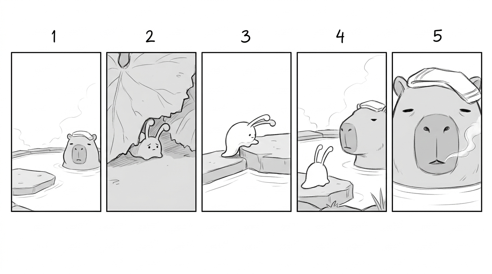
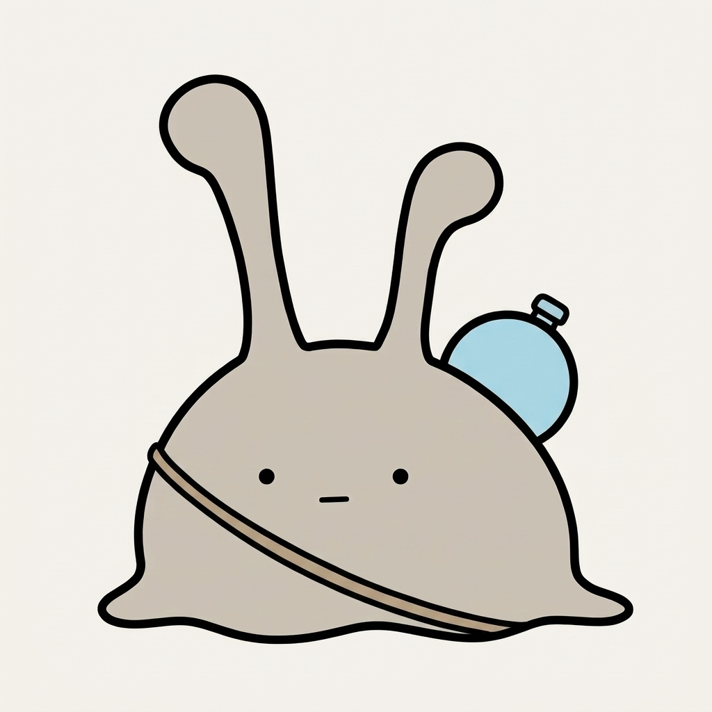
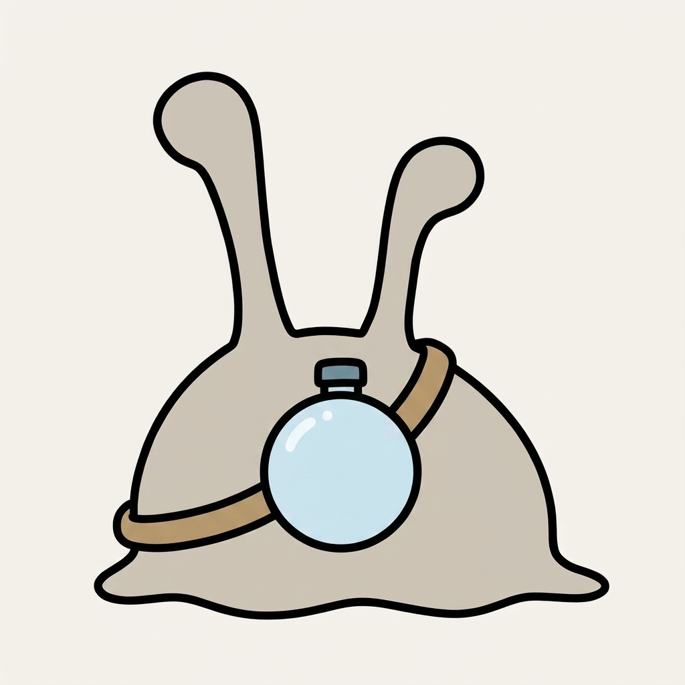
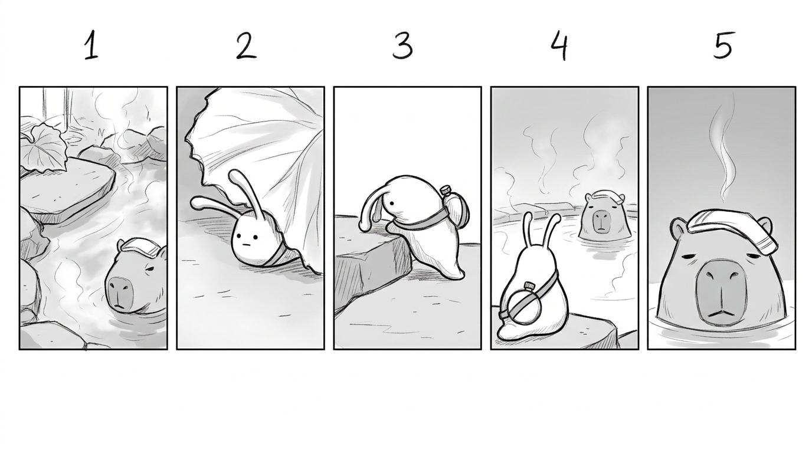
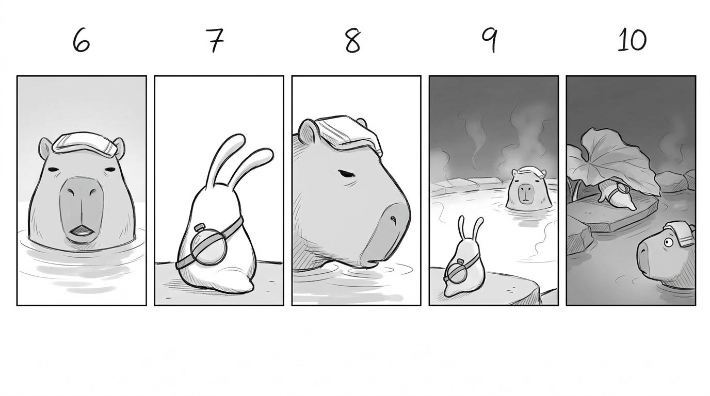

# 質問が来ない夕方を、絵コンテにした。露が消えて、ぬめは水筒を持った

## 前回のつづき

やってみ太郎です。へんてこ商事という会社で、中小企業のお客様向けにDX(業務をデジタルで変えること)やAI導入のお手伝いをしています。
AIで何かを「やってみた」記録を、1日1件ずつ残しています。

ナメクジの「ぬめ」と、カピバラの「どん」。
2匹の絵が、昨日ようやくそろいました。
次は、いよいよ動画の1本目です。

1本目に選んだのは、ネタ帳の11番「質問が来ない夕方」でした。

2匹は普段、よく話します。
夕方、温泉の湯だまりの縁で、ぬめが「どん、まだ熱い?」と聞く。どんは少し遅れて、「……んー。熱いっていうより、ぬるい寄りの熱い、だな」と、少しずれた答えを返す。
ところが、ぬめには、誰にも言わない用事があります。毎朝、乾きかけた苔に露を1粒運ぶこと。
その朝が近づくと、ぬめは黙ります。どんは、いつもの質問が来ないことで、それを察します。

11番は、その始まりの夕方です。
世界観の決まりには、「苔のことは口にしない」「気持ちを説明しない」「結末を描かない」とあります。
言葉を使わずに、「質問が来ない」ことだけを、数十秒の動画で伝えられるのか。
それを、絵コンテ(動画のカットを順に並べた設計図)の段階で確かめたかったんです。

時間は1時間と決めました。

## 会話の半分が、型から外れていた

絵コンテの前に、Claudeと一緒に「話す日」のネタ10件を読み直しました。
どれも、2日前にAIと作った会話です。

2匹の会話には型があります。ぬめが聞いて、どんがずらして返す。
1件ずつ読むと、どれも2匹らしく見えました。
ところが、この型を言葉にして横に置き、1件ずつ照らしてみると、10件中5件が外れていたんです。

たとえば「鼻の上の葉」。
ぬめ「どん、葉」。どん「ん」。
ぬめが聞いていません。どんも、ずれていません。
こう直しました。

> ぬめ「どん、葉。取らないの?」
> どん「……んー。乗ってるだけだな」

「なんで3回」は、型が逆でした。ぬめが葉の裏を3回なめる癖に、どんが「なんで3回だ」と聞いていたんです。
どんが質問をすると、それだけで「何かあった日」の合図になってしまいます。
これは、ぬめに聞かせることにしました。

> ぬめ「どん、見てた?」
> どん「……んー。2回半くらいだな」
> ぬめ「……そっか」

見ている人は、3回なめたのを見ています。どんの数え違いが、そのまま「ずれ」になる。
この1行が出たとき、少し笑いました。

いちばん多かった外れ方は、ぬめが質問していないことでした。
型の起点が抜けると、どんのずれも生まれません。

## 来なかった質問への答え

型が固まったので、絵コンテに入りました。

ネタ帳の11番には、こう書いてありました。
「ぬめが何も聞かない。湯気の側を向いて黙っている。どんも、いつもの話を始めない。暗くなる。翌朝、ぬめが葉から出る。『……行ったか』」。

Claudeが、これをそのまま絵にすると2か所が決まりとぶつかる、と言いました。

1つは、湯気の側を向くこと。
ぬめは暖かいのが好きで、普段から湯気の側、つまりどんの側を向いています。いつもと同じ向きでは、違いが出ません。
そこで、ぬめを反対側の庭石の方に向けて、どんに背を向けさせることにしました。

もう1つは、翌朝で終わること。
世界観には「1本の動画は、1つの朝か、1つの夕方」という決まりがあります。
翌朝の「……行ったか」は、次の回の始まりに回しました。代わりに、夜になっても、どんが目を閉じないところで切ります。普段のどんは、夜に目を閉じるんです。

それでも、まだ足りない気がしました。
この回を初めて見る人は、ぬめが普段よく話すことを知りません。黙っているだけでは、ただ静かな夕方に見えてしまう。

Claudeの案は、どんにひと言だけ言わせることでした。

> どん「……んー。今日は、ぬるい寄りだな」

誰にも聞かれていない質問への答えです。
「まだ熱い?」は来ていません。答えだけが出て、返事は返ってきません。
質問の不在を、その隣にある答えで見せる。これを採りました。

ここまでで、10カット、約35秒の絵コンテができました。
所要15分ほど。今日は早く終わりそうだ、と思っていました。

## 絵コンテに、絵がなかった

「完成しました」と報告を受けて、ファイルを開きました。
カットごとに、画面の説明、台詞、秒数、意図が並んでいます。
絵が、1枚もありません。

聞いてみると、Claudeは文章で絵コンテを作り、それで完了と判断していました。
Issueの「成果物は絵コンテ(Markdown)」という一文を、文字どおりに受け取っていたんです。
私は、絵も出すものだと思っていました。

絵の清書は、次の子Issueでやる予定です。
今日は、コマ割りと向きがわかる鉛筆書き風のラフにすることにしました。
Claudeが指示文を書き、私がGeminiに送ります。

鉛筆の線で、10コマが並びました。
どんの鼻を沈めた顔も、夜に目を開けたままの顔も、狙いどおりです。
ただ、ぬめの背中の露が、どのコマにもありませんでした。

原因は単純でした。
指示文でぬめの形を「ドーム形の体と、2本の触角」とだけ書き、露を書き落としていたんです。
参照画像に露が描いてあっても、文章に書かない持ち物は落ちました。

## 露を、水筒に変える

露を書き足せば直る話です。
でも、ラフを眺めているうちに、別のことを考えていました。

ぬめの水玉は、消えやすい。
透明な丸1つは、AIにとって描いても描かなくてもいい飾りに見えるのかもしれません。
いっそ、水筒にしたい。

Claudeは賛成しました。理由を2つ挙げています。
1つは設定です。露は、朝に苔へ運ぶ荷物です。夕方の回で背中に露がある方が、実は設定とずれていた。水筒なら朝も夕方も身につけていられて、露は朝だけ中に入れればいい。
もう1つは描きやすさです。形のはっきりした物の方が、AIは描き続けやすいはずです。

一方で、ネタ帳の2件は、露がむき出しなことを前提にしています。
「露が大きすぎて、背中から転がり落ちる」。「段差で露を落とし、土に消える」。
これは、水筒に合わせて作り直すことになります。

形は、丸い水筒を紐で斜めがけにすることにしました。
Claudeは続けて、水筒を足したラフの指示文を書きました。
水筒つきの決定稿(これを正解とする1枚)は、別の日に作る。そういう段取りでした。

指示文を読んでいて、引っかかりました。
添付する参照画像は、露のついた古いぬめのままです。

先に、ぬめの三面図を直す必要はないのか。

そう聞くと、Claudeはすぐに認めました。
参照画像に露が残ったまま、文章で水筒を足すと、AIは画像の方に引っぱられる。コマごとに水筒の形も揺れる。
3日前の記録に、自分たちで書いた学びがありました。「見た目の一貫性は、文章で詰めるより、1枚のアンカーを作る方が早い」。

## 水筒を持ったぬめ

正面、後ろ、斜め、横。1枚ずつGeminiに頼みました。

正面は、ほぼ一発でした。
露の玉は消え、体の右上の縁から、水筒が上半分だけのぞいています。紐が体の前を斜めに横切る。
点の目2つと、短い直線の口はそのままです。

後ろからは、水筒が全部見えます。
ただ、白い光が入って、前の露に少し似てしまいました。

斜めと横は、紐の色や太さが4枚でばらばらになりました。
「変えない」と書いたのは体だけで、水筒と紐の細かいところは書いていなかったんです。
ここは清書の日に揃えます。

ラフに要るのは、正面と後ろでした。
ぬめが背を向けるコマが4つあり、水筒がいちばん見えるのは後ろだからです。
2枚を1枚に並べて、ラフを出し直しました。

## ぬめは背を向けた。触角は、立ったままだった

水筒は、ぬめが出る6コマすべてにありました。
背中から描いたコマでは、ぬめがどんに背を向けて、湯気の向こうのどんだけがこちらを見ています。
最後のコマで、ぬめは葉の下へ入り、どんは目を開けたまま、そちらを向いている。
言葉がほとんどないのに、何かがいつもと違う夕方に見えました。

1つだけ、2回頼んでも出なかったものがあります。
触角の向きです。
この回では、ぬめの触角を前に倒して、庭石の方を指させるつもりでした。普段は立てて開いている触角が、今日だけ倒れている。それが、この回のいちばんの合図です。
「前に倒す」と書いても、「ほぼ水平で、左を指す」と角度で書いても、背中から描いたコマでは、触角はまっすぐ上に立っていました。

3日前、正面向きの表情シートでは、触角の向きは指示どおりに出ています。
向きの指示は、顔が見える角度でしか効かないのかもしれません。
まだ確かめていません。

## 今日の学び

- 会話の型を言葉にして横に置くと、自然に読めていた会話の半分が外れていた。いちばん多かった外れは、ぬめが質問していないことだった。
- 「質問が来ない」は、来なかった質問への答えで見せられた。どんの「今日は、ぬるい寄りだな」1行で、抜けた質問が見えた。
- 成果物の形は、Issueの言葉だけで決めない。「絵コンテ(Markdown)」と書いてあっても、絵は要った。
- 参照画像を添付していても、文章に書かない持ち物は落ちる。露は、指示文に書き落とした日に消えた。
- 持ち物を変えたら、ラフより先に決定稿を作り直す。正面と後ろを参照にしたら、水筒は全コマに出た。

露を書き足していれば、今日はもっと早く終わっていました。
でも、それでは水筒は生まれていません。露が消えたのを見て、私は「消えないものにしたい」と思いました。
それが、ぬめの持ち物そのものを考え直すきっかけになりました。
そして、水筒を足す前に決定稿を直すべきだと気づいたのも、Claudeではなく、指示文を読み返していた私の方でした。

絵コンテの文章、直した会話の一覧、指示文、今日の画像は、リポジトリに置いてあります。
https://github.com/h-takeshita-henteco-shoji-com/tried/tree/main/2026/10-08-かわいいキャラのショート動画をAIで作る-06-質問が来ない夕方の絵コンテを作る

## 次にやること

次は、絵コンテの各カットを、背景つきの静止画に清書します。
触角を倒すこと。7のコマで縦に伸びてウサギのようになったぬめを、元の丸い体に戻すこと。
それから、ばらばらだった水筒と紐の形を揃えること。

背中から見た触角を、AIは倒してくれるのか。
倒してくれないなら、昨日どんの目を直したときのように、Pythonで描き直すことになりそうです。
