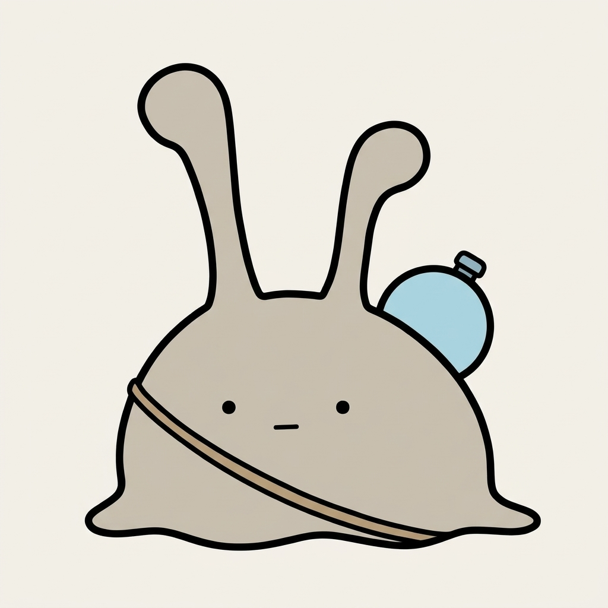
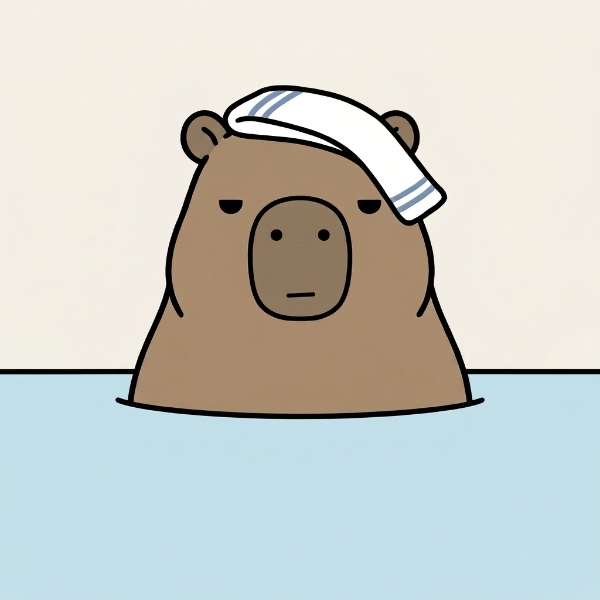
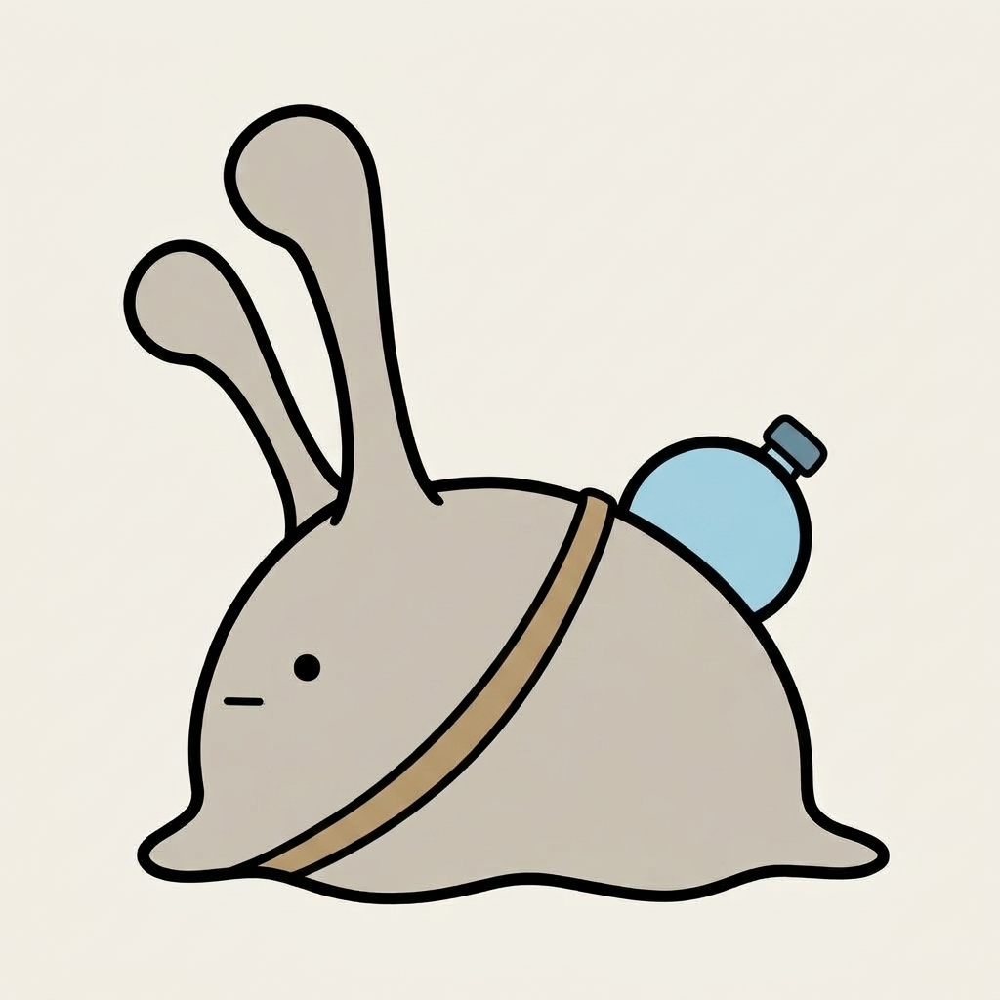
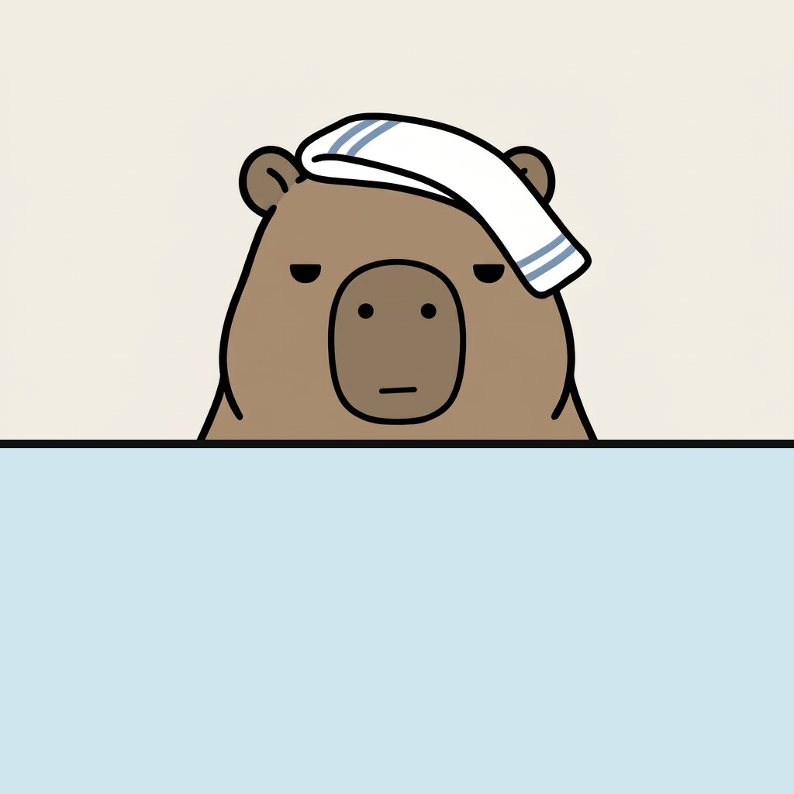
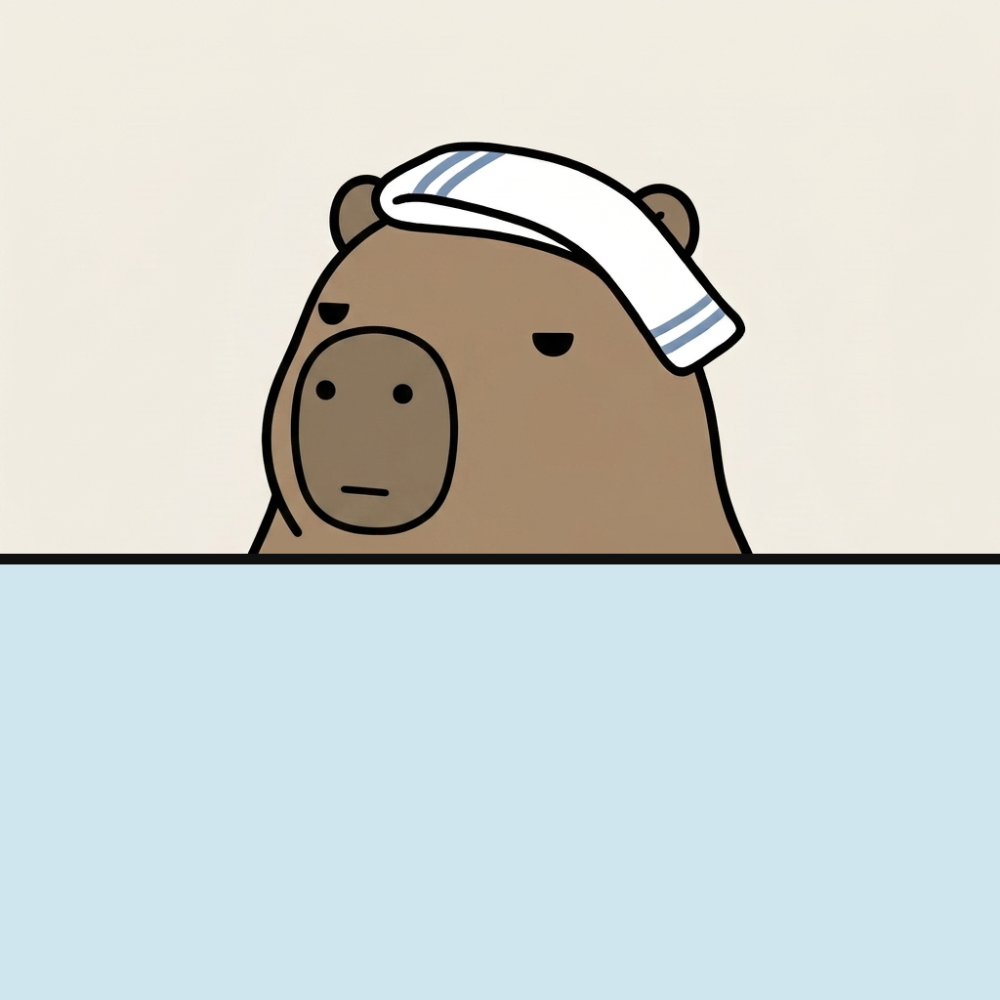
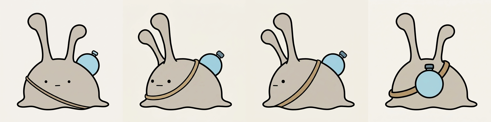

# どんを湯に沈めたかった。AIは沈めてくれなかった

## 前回のつづき

やってみ太郎です。へんてこ商事という会社で、中小企業のお客様向けにDX(業務をデジタルで変えること)やAI導入のお手伝いをしています。
AIで何かを「やってみた」記録を、1日1件ずつ残しています。

ナメクジの「ぬめ」と、カピバラの「どん」のショート動画を作っています。
今日の昼、1本目の絵コンテ(カットを順に並べた設計図)ができました。

絵コンテを見返すと、どんは5カットとも、温泉の湯から顔だけを出していました。
ところが、手元にあるどんの絵は、地面に座った全身の1枚だけです。
湯に浸かった姿がないと、清書(背景つきの完成した静止画)が作れません。

ぬめにも宿題が残っていました。
昼に、背中の露の玉を、紐で斜めがけにした水筒に変えたばかりです。
正面、後ろ、斜め、横の4枚を作ったものの、紐の色も太さも、水筒の光り方も、4枚でばらばらでした。

原因の見当はついていました。
指示文に「変えない」と書いたのは、ぬめの体だけ。水筒と紐の細かいところは、何も書いていなかったんです。
なら、細かいところまで書けば揃うはずです。

それを確かめたくて、同じ日の夕方、2件目に取りかかりました。
時間は60分。どんを先にやって、ぬめは横向きを優先します。

## 水筒は揃った。向きが揃わなかった

Claudeが、指示文を4本書きました。私がGeminiに送ります。

ぬめの水筒については、昼の正面と後ろの絵から、色を数字で測ってもらいました。
水筒は水色1色。白い光、中の水の線、帯は入れない。
紐は薄い茶色の細い帯が1本。輪も、結び目も作らない。
この決まりを、ぬめの指示文すべてに同じ言葉で入れました。

4枚が返ってきました。

ぬめの水筒は、決まりどおりでした。
光も水の線も消えて、紐は細い薄茶の1本。昼の正面と並べても見分けがつきません。
細かいところを書けば揃う。見当は当たっていました。

ただ、肝心の向きが違いました。



真横を頼んだぬめは、正面のままでした。
斜めを頼んだ方も、体は回らず、目と口が少し左に寄っただけです。

参照画像(AIに「この見た目で」と渡す手本の絵)には、正面と後ろを並べた1枚を渡していました。
AIは、文章の「真横」より、手本の絵の向きを守ったようです。

どんの方も、思ったようにはいきませんでした。



正面の顔も、頭の手ぬぐいも、元の絵のままです。
でも、湯があごまで来ていません。ほおの下まで体が出ています。
よく見ると、背景の線と湯の線が、上下に2本あります。

どんは、頭と体がひと続きの、まるいかたまりです。
「あごまで浸かる」と書いても、あごがどこなのか、AIにはわからなかったのかもしれません。

左を向かせた方は、また別の崩れ方でした。
湯の中に体が透けて見えて、鼻には縦線、口は「へ」の字。
前の日、どんの横顔を作ったときとまったく同じ線が、また生えていました。

## 向きの合った1枚から直す

ぬめの真横には、手がありました。

昼に作った古い真横は、紐が輪になって、水筒に水の線が入っていました。
でも、向きだけは正しく真横だったんです。

向きの合った絵を土台にして、水筒と紐だけを直してもらえばいい。
Claudeはそう考えて、古い真横1枚だけを添付する指示文に書き換えました。
直す場所は、水筒の塗りと、紐の形だけです。

どんは、湯の高さを、画像の中の位置で書き直しました。
「鼻のまわりの濃い色の部分の、すぐ下まで」。
湯は不透明に。横線は1本だけ。
左を向かせる方には、前に生えた鼻の縦線と「へ」の字の口を、名指しで禁じました。



ぬめの真横は、一発で通りました。
向きはそのままで、水筒は水色1色に、輪だった紐は1本の帯になりました。

どんは、2枚とも外れでした。
正面の方は、湯の線が少し上がっただけです。体は湯の手前に描かれていて、沈んでいるようには見えません。
左向きの方は、湯そのものが消えて、座った全身の絵に横線が1本引かれていました。

ただ、その外れの絵の中に、拾えるものがありました。
左を向いた顔が、良かったんです。
鼻の縦線も、「へ」の字の口もない。点の目と短い線の口のまま、ちゃんと左を向いています。

## 湯は、AIに描かせなくていい

どんを湯に沈める絵は、2回頼んで2回とも出ませんでした。
3回目の指示文を考えかけたところで、Claudeが別のことを言いました。

湯は、平らな水色と、線が1本あるだけ。
それなら、画像処理で塗ればいい。

元のどんの絵と、さっきの左向きの絵に、Pythonで湯を重ねます。
やっていることは、これだけです。

```python
d.rectangle([0, y, w, h], fill=(0xCF, 0xE6, 0xEE))  # 湯
d.rectangle([0, y-5, w, y+5], fill=(0x10, 0x10, 0x10))  # 湯の線
```

鼻のまわりのすぐ下に高さを決めて、そこから下を水色で塗り、黒い線を1本引く。





あごまで湯に浸かったどんが、2枚できました。
湯の高さは、数字を1つ変えれば上げ下げできます。

少し、拍子抜けしました。
AIに何度も言い方を変えて頼んでいたものが、2行で済んでしまった。
しかも、左向きの絵は、湯を描くのに失敗した絵から作っています。

## 回し足りないなら、向こう側から回す

残りは、ぬめの斜めと後ろです。

斜めは、昼も、今日の1回目も、正面から回そうとして回りませんでした。
AIは、頼んだ角度まで回し切らない。手本の絵の向きに戻ろうとします。

Claudeの案は、逆から回すことでした。
今度は、さっきできた真横を土台にして、正面の側へ45度回してもらう。
回し足りなくても、真横と正面の間で止まるなら、それが斜めです。

後ろは、水筒の白い光を消すだけにしました。



斜めは、狙いどおり真横と正面の間で止まりました。
両目が見えて、体は横を向いたまま。水筒は背中の上から半分のぞいています。
後ろも、光だけが消えて、ほかは何も変わりませんでした。

4枚を並べると、水筒の水色も、ふたの青灰色も、紐の色と太さも、同じでした。
昼に、4枚がばらばらで眉をひそめた、あの並びです。

1つだけ残りました。斜めの触角が、真横と同じ重なり方のままです。
清書で目立つようなら、そのときに直します。

## 今日の学び

- 持ち物は、色、太さ、光の有無、輪の有無まで書くと揃った。昼は体だけ「変えない」と書いて、水筒と紐がばらばらになっていた。
- 向きは、文章より手本の絵で決まった。正面と後ろの絵を渡すと、真横と頼んでも正面が出た。真横は、向きの合った古い絵を直すと一発で出た。
- AIは回し足りない。正面から回すと斜めにならず、真横から回すと斜めで止まった。
- 湯に沈める絵は、AIでは出なかった。平らな湯は、Pythonで2行だった。
- 失敗した絵にも、使える部分がある。左を向いたどんの顔は、湯が消えた絵から拾った。

いちばん時間を使ったのは、どんを湯に沈めることでした。
「あごまで」「鼻のすぐ下まで」と、言い方を変えて2回。
その間ずっと、どうすればAIが沈めてくれるかばかり考えていました。
AIに頼むことと、AIでなくていいことの境目は、頼んでいる最中には見えにくいみたいです。

指示文、今日の画像、湯を重ねたときの記録は、リポジトリに置いてあります。
https://github.com/h-takeshita-henteco-shoji-com/tried/tree/main/2026/10-08-かわいいキャラのショート動画をAIで作る-07-どんの湯の姿とぬめの4面を揃える

## 次にやること

次は、2匹が座る湯だまりの縁の背景を作ります。
そのあと、絵コンテの10カットを清書します。

清書では、昼から持ち越しの宿題が待っています。
背中から見たぬめの触角を、前に倒すこと。2回頼んで、2回ともまっすぐ立ったままでした。
今日の「向こう側から回す」は、触角にも効くのでしょうか。
