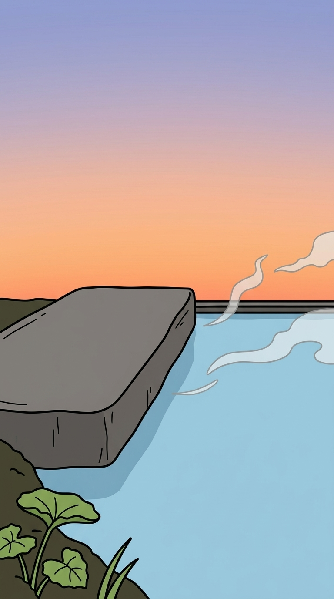
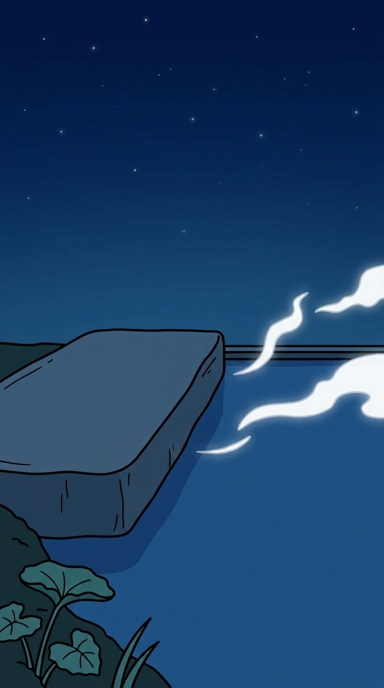
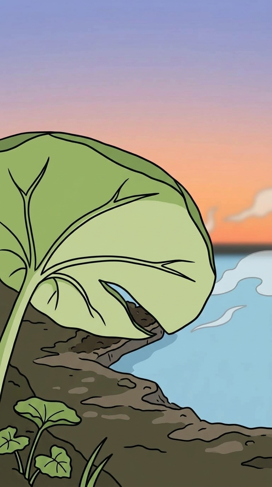

# 湯だまりを頼んだら、海が来た

## キャラのいない絵を作る

やってみ太郎です。へんてこ商事という会社で、中小企業のお客様向けにDX(業務をデジタルで変えること)やAI導入のお手伝いをしています。
AIで何かを「やってみた」記録を、1日1件ずつ残しています。

ナメクジの「ぬめ」と、カピバラの「どん」のショート動画を作っています。
今日の夕方、どんを湯に沈めた絵と、ぬめの4面の絵が揃いました。
残っているのは、2匹が座る場所の絵です。

舞台は、夕方の小さな湯だまりの縁です。
ぬめは縁の石の上に乗り、どんは湯から顔だけを出します。

ここまでキャラの絵を作ってきて、1つ気づいていたことがあります。
キャラと背景を1枚でまとめて頼むと、キャラの見た目が崩れやすいんです。
目の形、触角の向き、水筒の紐。背景のことまで考えさせると、どこかがずれます。

なら、背景はキャラ抜きで作ればいい。
キャラは、あとから上に重ねます。

絵コンテ(カットを順に並べた設計図)を見返すと、要る背景は3枚でした。

- カット1: 夕方の湯だまりの縁を、引きで
- カット9: 同じ構図の夜
- カット2: フキの葉の端の寄り。ぬめが葉の下から顔を出す場面

カット9は、1と同じ場所で、空の色だけが夕方から夜へ変わります。
夕方と夜で、構図がぴったり同じ2枚が作れるか。
今日いちばん気になっていたのは、そこでした。

時間は60分。夕方を先に決めて、夜はそれを手本に色だけ変えます。

## 決めごとを、指示文に並べる

Claudeが、絵コンテから指示文を書きました。私がGeminiに送ります。

絵コンテには、画面の向きの決まりがあります。
左が庭石の側、右が湯だまりと湯気の側。庭石そのものは映しません。
指示文には、これをそのまま書きました。

さらに2つ足しました。
1つは、右下の水面を空けておくこと。あとで、どんの顔を置く場所です。
もう1つは、ぬめとどんの絵を「画風の手本」として添付すること。キャラは描かせず、黒くて太い線と、平らな塗り方だけを合わせてもらいます。

指示文の一部は、こんな形です。

```
- 画面の左: 縁の平たい石。上面は平らで、何も載っていない。
- 画面の右と右下: 湯だまりの水面。右から左へ、湯気がゆるく流れる。
- 右下の水面は、後で顔を重ねるため、物を置かずに空けておく。
```

## 決めたことは、全部守られていた

夕方の1枚が返ってきました。



左に平たい石。上には何も載っていません。
右から湯気が流れ、右下の水面は広く空いています。
左下の隅には、フキの葉が少しだけ。
線の太さも塗り方も、どんの絵と並べて違和感がありません。

頼んだことは、全部入っていました。

ただ、しばらく見ていて、あれ、と思いました。
この湯だまり、海に見えるんです。

水面がずっと奥まで続いて、そのまま空とぶつかっています。
向こう岸がありません。
奥には、何を描いたのかわからない黒い二重線が1本。
石も角ばっていて、コンクリートの塊のようです。

指示文を読み返すと、理由は単純でした。
「向こう岸」とは、ひと言も書いていません。
書かなかったところを、AIは自分で埋めました。
小さな湯だまりの奥に何があるか知らないまま、いちばんありそうな「水平線」を描いたんだと思います。

## 夜は、色だけが変わった

直すかどうかは、いったん置きました。
先に、今日の本題の夜を試します。

夕方の1枚だけを添付して、こう頼みました。
構図、線、形はまったく同じに。変えるのは色だけ。



正直、どこかはずれると思っていました。
どんを横に向かせようとしたときは、頼んでいない線が何度も生えてきたからです。

ところが、石の輪郭も、葉の形も、湯気の曲がり方も、夕方とずれていません。
空が紺になって、星が出て、全体が青く沈んだ。変わったのは、それだけでした。

これなら、カット9の「空の色だけが変わる」は、2枚を重ねてゆっくり切り替えれば作れます。
夜の変化は、生成ではなく編集で付けられる。

1つだけ気になったのは、湯気です。
「夜でも見えるように白く残す」と書いたら、光っているくらい白くなりました。
これは編集で弱められます。

## フキの葉の下

最後に、フキの葉の寄りです。
ぬめが葉の端から顔を出す、カット2の背景です。

夕方の1枚を添付して、同じ場所、同じ色で寄ってもらいました。



葉を少し下から見上げていて、葉の裏が見えます。
奥の空の色も、湯気も、夕方の1枚と同じでした。

葉の中ほどに切れ込みがあって、葉が折れたようにも見えます。
地面だけ、ほかより描き込みが多い。
それでも、葉の下の陰は、ぬめが顔を出すのにちょうどいい暗さです。

## 海のままにした

3枚が揃ったところで、夕方の海をどうするか決めることにしました。

直すなら、指示文に「奥に向こう岸の土と草」と書き足します。
ただ、夜とフキの葉は、どちらも夕方の1枚を手本に作っています。
夕方を直せば、3枚とも作り直しです。

Claudeから、別の見方が出ました。
右下の水面には、あとで、どんの顔が乗ります。
どんの顔は大きいので、海に見えていた水面のかなりの部分が、顔で埋まります。

それで、このまま使うことにしました。
水平線が本当に気にならないかは、どんを重ねてみるまでわかりません。

## 今日の学び

- キャラ抜きで背景を作ると、画風の手本を添付するだけで、線と塗りが揃った。
- 書かなかったものは、AIが補う。「向こう岸」を書かなかったら、湯だまりは海になった。
- 1枚を添付して「色だけ変える」と頼むと、輪郭は動かなかった。夕方から夜への変化は、編集で付けられる。

今日いちばん驚いたのは、夜の1枚でした。
これまでは、向きひとつ思いどおりにならずに苦労していました。
それが、色だけ変えてと頼むと、線1本動かさずに返ってきた。
AIは、形を変えるのは苦手でも、形を変えないのは得意なのかもしれません。

その一方で、夕方の1枚は、頼んだことを全部守ったうえで海になっていました。
守ってほしいことを並べるのに夢中で、そこに何があるかを書くのを忘れていたんです。

指示文と今日の画像は、リポジトリに置いてあります。
https://github.com/h-takeshita-henteco-shoji-com/tried/tree/main/2026/10-08-かわいいキャラのショート動画をAIで作る-08-湯だまりの縁の背景を作る

## 次にやること

次は、絵コンテの10カットを清書します。
今日の背景に、ぬめとどんを重ねます。

右下の水面に、どんの顔が乗ったとき。
あの水平線は、まだ海に見えるでしょうか。
