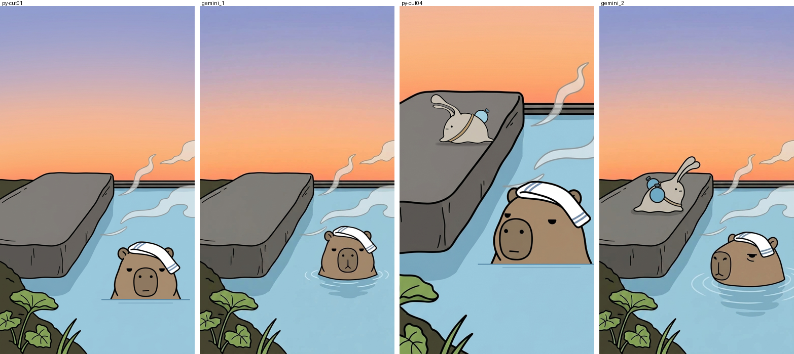
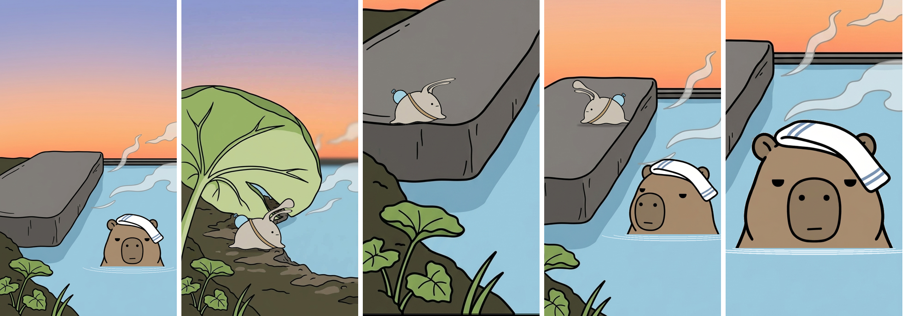
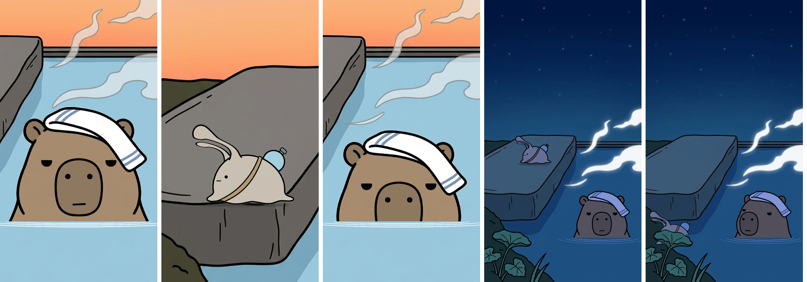

# ぬめを並べるのは、AIよりPythonのほうが上手だった

## 6倍と書いたのに

やってみ太郎です。へんてこ商事という会社で、中小企業のお客様向けにDX(業務をデジタルで変えること)やAI導入のお手伝いをしています。
AIで何かを「やってみた」記録を、1日1件ずつ残しています。

ナメクジの「ぬめ」と、カピバラの「どん」のショート動画を作っています。
絵コンテ(カットを順に並べた設計図)は10カット。
2匹の絵も、2匹が座る湯だまりの背景も揃いました。

今日は、その10カットを1枚ずつの静止画に仕上げます。
背景の上に、ぬめとどんを重ねる作業です。

気がかりが1つありました。
少し前、AIに2匹を一緒に描かせたとき、「どんの顔は、ぬめの体の6倍」と書いたんです。
返ってきた絵では、2匹がほとんど同じ大きさでした。
大きさの決まりを、AIはあっさり無視しました。

それなら、AIに任せなければいい。
2匹の絵を背景から切り抜いて、Python(プログラミング言語の1つ)で決めた位置に貼れば、大きさは数字どおりになるはずです。

ただ、Pythonで貼った絵は、どこか「貼りました」という顔をしがちです。
AIに描かせたほうが、背景に馴染むかもしれない。

そこで、2つのやり方を比べることにしました。
AIに重ねてもらう方法と、Pythonで切り抜いて置く方法。
比べるのは2カットだけにして、速いほうで残りを揃えます。

## 切り抜きは、あっけなかった

先にPythonから始めました。コードはClaudeが書きます。

ぬめとどんの絵は、どちらもクリーム色の無地の上に描いてあります。
画像の外側からクリーム色を塗りつぶしていけば、黒い輪郭線で止まるはず。
そう考えて試すと、6枚とも、きれいに抜けました。

あっけないくらいでした。
太い黒線の画風が、ここで効いたんです。

## 触角が、後ろへ倒れた

次が、今日いちばんの山でした。

この回のぬめは、触角を前に倒したままです。
いつもは上に立てて開いている触角が、前に倒れている。
それだけで「今日のぬめは、いつもと違う」と伝える。この回の一番の合図です。

ところが、手元のぬめの絵は、どれも触角が上に立っています。
前に倒れた絵は、1枚もありません。

Claudeの案は、触角だけを曲げることでした。
付け根はそのままにして、先へ行くほど大きく回します。
コードの芯は、この数行です。

```python
d = np.clip((y0 - yy) / ramp, 0, 1)   # 付け根からの離れ具合
th = np.radians(deg) * (3 * d**2 - 2 * d**3)  # 先ほど大きく回す
```

1回目、触角は後ろへ倒れました。
回す向きが、逆だったんです。

2回目は、向きは合いました。
でも、頭のてっぺんの線まで一緒に曲がって、黒い線が宙に飛び出しました。

触角だけを別の層に切り分けて、3回目でようやく、触角は前へ倒れました。
30°、40°、50°と並べて、40°にしました。
付け根の線はつながったままで、もとからこういう絵だったように見えます。

## 3倍は、小さすぎた

いよいよ重ねます。
大きさの決まりは、6倍から見直して「どんの頭の高さは、ぬめの体の幅の3倍」。
2匹が並ぶカット4で、数字どおりに置いてみました。

ぬめが、豆粒でした。
石の上にちょこんと乗って、前に倒した触角も、目をこらしてやっと見えます。

しかも、貼り絵に見えます。
ぬめを7分の1ほどに縮めたせいで、黒い輪郭線が細くなっていたんです。
どんの線と比べると、3分の1くらいしかありません。
縮める前に線を太らせておくと、2匹の線が揃いました。

線は揃いました。
でも、ぬめはやっぱり小さい。

「もう少し大きく描きたい」と伝えると、Claudeは3倍、2.5倍、2倍、1.5倍の4枚を並べてきました。
2倍を選びました。
直ったカット4を見て、まだ小さいと思いました。
今度は2倍、1.75倍、1.5倍。
1.5倍にしました。

「3倍」は、絵コンテを書いたときに、自分で決めた数字です。
文字で書いていたときは、ちょうどいいと思っていました。
画面に置いてみると、半分の1.5倍でようやく、ぬめがそこに居ると思えました。

## AIに頼んだ2枚

次は、AIの番です。
Geminiに、背景と2匹の絵を添付して頼みました。
大きさは1.5倍、ぬめは左を向いてどんに背を向ける、触角は前に倒す。
決めたことは、全部、指示文に書きました。

どん1匹だけのカット1は、ほぼ注文どおりでした。
背景は崩れず、石の上も空いたまま。
しかも、どんの首のまわりに、波紋が描いてありました。

Pythonで作ったほうは、水面に線を2本引いただけです。
並べると、AIのどんは湯に浸かっていて、Pythonのどんは湯の上に置いてある。
馴染み方は、AIの圧勝でした。

ところが、2匹が並ぶカット4で、話が変わりました。



ぬめは、右を向いていました。
背を向けるはずのどんと、向かい合っています。
触角は上に立って、少し後ろへ反っていました。
水筒は2つに増えています。
大きさは、ぬめのほうがどんの頭より大きい。

触角、向き、大きさ。
この回で守りたかった3つが、3つとも外れていました。

1匹なら、注文どおりに描ける。
2匹になると、決まりを抱えきれなくなる。
6倍が無視された日と、同じことが起きていました。

残りのカットは、Pythonで揃えることにしました。
AIに負けた波紋だけは、Pythonで真似します。
首のまわりに、手前だけの弧を3本。
それだけで、どんは湯に浸かって見えるようになりました。

## 動きは、静止画には入らない

残りは8カット。順調だったわけではありません。

カット2は、ぬめがフキの葉の下から顔を出す場面です。
ぬめを葉の陰に入れて、上から葉を描き戻しました。
顔と触角が、葉に隠れました。
葉と地面のすき間が、ぬめより狭かったんです。
葉のすぐ下で、手前に出てくる位置に変えました。

カット3は、ぬめが縁の石に登る場面です。
体を斜めに傾けて、登っている途中を描こうとしました。
35°では、跳んでいるように見えました。
60°に起こすと、体が縦に伸びて、ウサギになりました。
ラフ(下描き)でAIが描いたぬめも、縦に伸びてウサギに見えていたんです。
AIでもPythonでも、同じところで崩れました。

結局、登りきった瞬間の絵にしました。
石の角に体を載せて、触角は70°まで下げます。
登る動きそのものは、次の「静止画を動画にする」日に任せます。



カット7は、ぬめの背中の寄りです。
背中から見た絵で、触角を縦に縮めて、向こうへ倒れたように見せました。
出てきたのは、横に開いた角でした。
前に倒れているとは、どうしても読めません。
真横の絵に変えると、どんに背を向けた向きのまま、触角の合図がはっきり見えました。

カット8は、どんが鼻だけを湯に沈める直前です。
ラフでは、鼻先まで沈んでいて、鼻が見えませんでした。
湯を口の高さまで上げると、鼻先だけが水面に残りました。

カット9と10は夜です。
夜の背景に夕方の色のまま2匹を置くと、2匹だけが光って見えます。
キャラの色を暗く、青寄りにしました。

カット10では、ぬめが葉の下へ帰っていきます。
ぬめは葉の手前、カメラに近い側にいるので、1.5倍より大きくしても遠近として通ります。
1.0倍にして、大きすぎて、1.2倍に戻しました。



予定では2日に分けるつもりでした。
10カット、今日で揃いました。かかった時間は30分です。

## あの水平線

前回、背景の湯だまりは海に見えていました。
向こう岸がなくて、水面がそのまま空とぶつかっていたんです。
どんの顔が乗れば気にならなくなるかもしれない、と、そのまま使いました。

カット1を見返すと、水平線は、まだそこにあります。
ただ、右下には、波紋を広げてどんが浸かっています。
海かどうかより先に、どんの半分閉じた目に目が行きました。

## 今日の学び

- LLM(ChatGPTやGeminiのような、文章を読んで書くAI)より、Pythonによる合成のほうが上手くいった。AIは、キャラが1匹なら注文どおりに描けた。2匹になると、向き、触角、大きさが3つとも外れた。
- 大きさの比率は、文字で決めるより、絵を並べて決めるほうが早い。「3倍」は、画面に置くと小さすぎた。最後は1.5倍になった。
- 縮めたキャラは線が細くなって、貼り絵に見える。縮める前に線を太らせると、ほかの絵と揃う。
- 体を大きく傾けると、跳んで見えるか、ウサギになった。動きは静止画に入れず、動画に回す。

今日いちばん意外だったのは、カット1の波紋でした。
AIに勝つつもりで始めたのに、最初の1枚で、馴染み方では負けていました。
それでも、2匹目が入った途端、AIは触角も向きも大きさも手放しました。
Pythonは、触角を後ろへ倒しもしたけれど、一度決めた数字は二度と外しません。

AIが得意なのは、絵を馴染ませること。
決めごとを守らせたいなら、数字で持たせたほうが確かでした。

指示文、Pythonのコード、今日の画像は、リポジトリに置いてあります。
https://github.com/h-takeshita-henteco-shoji-com/tried/tree/main/2026/10-08-かわいいキャラのショート動画をAIで作る-09-絵コンテの静止画を作る

## 次にやること

次は、この10枚を動画にします。
葉の裏をなめる、石に登る、口を開きかける。
今日、静止画から外した動きを、今度は描いてもらいます。

動かすのは、AIです。
2匹が並んで動くとき、ぬめの触角は、前に倒れたままでいてくれるでしょうか。
